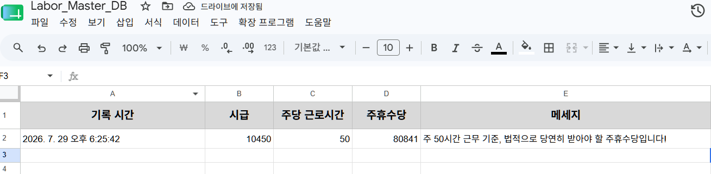

# [Pre-totyping] 알바몬 커뮤니티 가설 검증 및 초기 로그 분석

## 1. 가설 (Hypothesis)

- **배경:** 파견 및 단기 근로 현장(예: 공장 생산직)에서는 급여명세서 지연 및 주휴수당 누락이 빈번하게 발생한다.
- **핵심 가설:** "근로자들은 주휴수당을 직접 계산하는 것에 피로를 느끼며, 직관적이고 가벼운 주휴수당체크 기능만이 탑재된 웹 링크를 알바몬 커뮤니티에 걸어주면 자신의 노동 시간과 시급을 입력하여 주휴수당을 확인할 것이다."

## 2. 실행 (Execution)

- **테스트 일시:** 2026년 7월 29일
- **테스트 채널:** 알바몬 커뮤니티 (노무상담/알바토크 게시판)
- **액션:** 문제에 공감하는 서사를 담은 게시글을 작성하고 하단에 주휴수당 체크 링크 배포.

## 3. 결과 및 지표 (Results & Metrics)

배포 직후, Vercel 랜딩페이지와 연동된 **구글 시트 백엔드 로그 시스템**을 통해 실제 타겟 유저의 자발적인 데이터 입력 값을 실시간으로 포착함.

| 주요 지표 (Key Metrics) | 목표치 (Target)    | 실제 결과 (Actual)           | 비고                                                      |
| :---------------------- | :----------------- | :--------------------------- | :-------------------------------------------------------- |
| **자발적 입력 액션 수** | 24시간 내 5건 이상 | **1건** (진행 중)            | 시급 10,450원 / 주 50시간 근무자                          |
| **가설 판정**           | -                  | **진행형 (Demand Verified)** | 정량적 목표에는 미달했으나 실제 타겟의 실데이터 확보 성공 |

## 4. 증명 자료 (Proof)

유저가 직접 자신의 노동 가치를 입력한 첫 번째 인터랙션 기록이 구글 시트 로그 시트에 실시간으로 기록된 모습.

## 5. 분석 및 다음 단계 (Insights & Next Steps)

- **인사이트:**
  1. 배포 후 24시간이 채 되지 않은 시점에서 실제 타겟 유저의 자발적 로그(시급 10,450원, 주 50시간)를 확보하여 **시장 수요(Demand)의 실존을 검증**함.
  2. 주 50시간 입력 사례를 통해, 근로기준법상 주휴수당 산정 기준(최대 40시간)에 대한 안내 및 **법적 상한선 초과에 대한 UI/UX 알림 기능**의 필요성을 확인함.
  3. 단순한 수치 계산을 넘어, 근로자들이 현장에서 겪는 고충을 직접 해결하고 사업주에게 권리를 요구할 수 있는 **'실행 가능한 솔루션(법적 대응 문구 생성 등)'**으로의 피벗 필요성 도출.

- **Next Step (Strategic Pivot):**
  1. **시스템 고도화:** 주 40시간 초과 입력 시 주휴수당 계산 기준 안내 및 법적 기준 캡(Cap) 적용 알림 기능 추가.
  2. **핵심 기능 확장:** 노동자들이 자주 겪는 고충을 3가지 유형으로 분류하고, 옵션 선택 시 관련 법적 조항과 대응 추천 문구가 자동 생성되며 원클릭으로 복사되는 기능(v2) 기획 및 개발.
  3. **2차 프리토타이핑:** 고도화된 기능을 바탕으로 타겟 맞춤형 메시지로 2차 시장 검증 재돌입.
