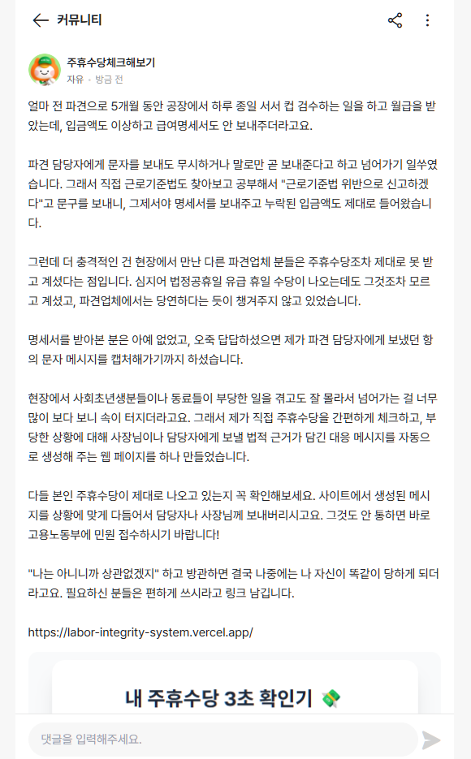
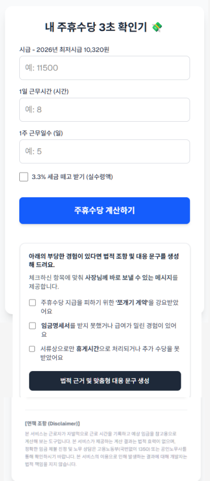

# [Pre-totyping] 2차 알바몬 커뮤니티 가설 검증: 대응 메시지 생성기 피벗

## 1. 가설 및 목표 지표 (Hypothesis & Target Metrics)

- **배경:** 1차 프리토타이핑(`01-albamon-hypothesis-test.md`) 결과, 타겟 유저(파견/단기 근로자)의 수요는 확인했으나 단순 계산 기능만으로는 행동 유도(Action)에 한계가 있음을 파악함. 유저들은 계산된 수치를 바탕으로 사업주에게 직접 항의할 수 있는 실질적인 '무기'를 원한다.
- **핵심 가설:** "근로기준법 위반(명세서 미지급, 주휴수당 누락 등) 상황에 맞춰 '사장님께 보낼 법적 근거가 포함된 카톡 메시지'를 자동 생성해 주는 기능을 제공하고, 개발자의 실제 파견직 고충 서사가 담긴 글과 앱 캡처 화면을 커뮤니티에 올리면, 단순 계산기 링크 배포 때보다 훨씬 더 높은 전환율과 메시지 복사 액션을 유도할 수 있을 것이다."
- **가설 검증 목표 지표 (Success Criteria):**
  - 배포 후 **24시간 내 자발적 메시지 생성 및 복사 액션 10건 이상 발생** 시 피벗된 솔루션의 시장 적합성(PMF, Product-Market Fit)이 매우 높다고 판단함.

## 2. 실행 (Execution)

- **테스트 일시:** 2026년 7월 30일
- **테스트 채널:** 알바몬 커뮤니티 (노무상담/알바토크 게시판)
- **액션:**
  1. 5개월간 컵 공장에서 파견직으로 일하며 겪은 임금/명세서 누락 경험과 이를 직접 해결한 진솔한 서사를 담은 게시글 작성.
  2. 직관적인 이해를 돕기 위해 '대응 메시지 자동 생성 결과 화면'을 캡처하여 게시글에 첨부.
  3. 게시글 하단에 Vercel 랜딩페이지(v2) 링크 배포.

## 3. 결과 및 지표 (Results & Metrics)

게시글 업로드 직후, Vercel 앱과 연동된 구글 시트 백엔드 로그 시스템을 통해 타겟 유저의 메시지 생성 옵션 선택 및 액션 로그를 실시간 모니터링 중.

| 주요 지표 (Key Metrics)     | 목표치 (Target)     | 실제 결과 (Actual)               | 비고                                    |
| :-------------------------- | :------------------ | :------------------------------- | :-------------------------------------- |
| **자발적 메시지 생성 액션** | 24시간 내 10건 이상 | **데이터 수집 중**               | (배포 직후 모니터링 진행 중)            |
| **자주 선택된 고충 옵션**   | -                   | **데이터 수집 중**               | 주휴수당 누락 / 명세서 미지급 / 기타 등 |
| **가설 판정**               | -                   | **진행형 (Testing in Progress)** | -                                       |

## 4. 증명 자료 (Proof)

알바몬 커뮤니티에 업로드한 2차 프리토타이핑 게시글 및 첨부된 앱 구동 캡처 화면.
_(추후 로그 데이터 확보 시 구글 시트 캡처본 추가 예정)_

<!-- TODO: 24시간 뒤 의미 있는 유저 로그 확보 시 아래에 이미지 추가 -->
<!--  -->

## 5. 분석 및 다음 단계 (Insights & Next Steps)

- **인사이트 (데이터 수집 전 예상):** 1차 프리토타이핑의 건조한 설명글 대비, 현장감 있는 5개월의 파견 고충 서사와 '카톡 복붙 캡처'라는 시각적 후킹이 유저들의 공감대와 클릭을 강하게 이끌어 낼 것으로 기대됨.
- **Next Step:**
  1. 24시간(7월 31일) 경과 후 누적된 구글 시트 로그 확인 및 지표(Results) 업데이트.
  2. 유저들이 가장 많이 선택한 '고충 유형(옵션)'을 분석하여, 추후 해당 노동법 관련 대응 문구의 디테일을 더욱 고도화.
  3. 알바몬 외 추가 커뮤니티(예: 에브리타임, 오픈카톡방 등)로의 테스트 확장 타당성 검토.
