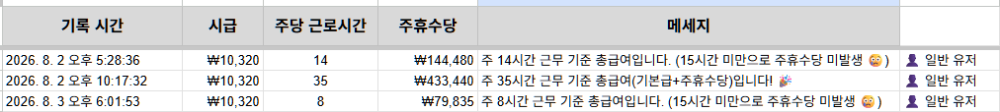
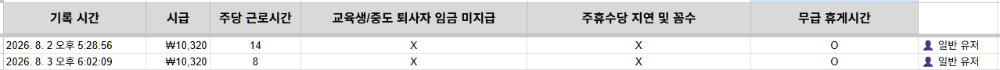
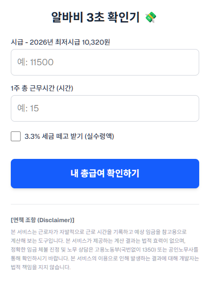
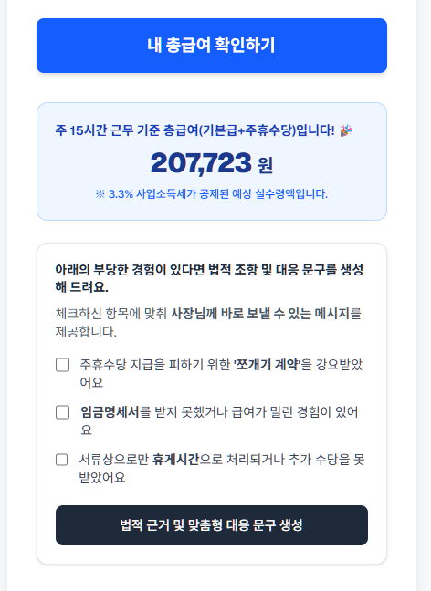
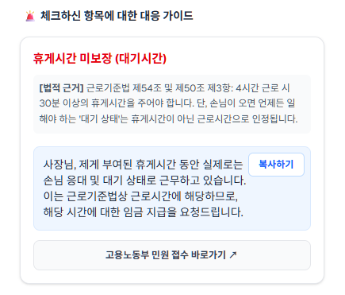

# [Pre-totyping] 3차 가설 검증: 총급여/명세서 유틸리티 추가 및 알바몬 커뮤니티 집중 공략

## 1. 가설 및 목표 지표 (Hypothesis & Target Metrics)

- **배경:** 2차 프리토타이핑(`02-albamon-message-generator-test.md`) 결과, 타겟 유저의 문제 상황(임금 체불, 명세서 미지급)을 저격한 서사와 부당함 대응 생성 메시지 기능을 제공했음에도 즉각적인 트래픽 확보에 아쉬움이 있었음. 유저가 일상적으로 찾는 '기본 유틸리티(총급여 계산)'를 미끼(Hook)로 추가하여, 알바생들이 가장 활발하게 소통하는 **알바몬 커뮤니티(알바토크 등)** 내에서 초기 진입 장벽을 낮추고 가설을 재검증하고자 함.
- **XYZ 정량 가설:**
  - "최소 **10명(X)**의 **알바몬 커뮤니티 게시글을 읽고 링크를 클릭해 진입한 단기/파견 근로자(Y)**가, 새롭게 추가된 **총급여 계산 기능 버튼을 클릭한 후, 임금명세서, 휴게시간에 관련 부당함 경험 체크박스 중 1개를 클릭하여 법적조항 및 대응 문구를 생성(Z)**할 것이다."
- **가설 검증 목표 지표 (Success Criteria):**
  - 배포 후 **48시간 내 알바몬 커뮤니티 유입을 통해 총 10건 이상의 법적조항 및 대응 문구를 생성** 시, 해당 가설이 검증된 것으로 판단함.

## 2. 실행 (Execution)

- **테스트 일시:** 2026년 8월 2일 ~ 8월 4일 (48시간)
- **테스트 채널:** 알바몬 앱/웹 내 커뮤니티 (알바토크, 알바경험담, 노무상담 등 관련 게시판)
- **액션:**
  1. **UI/UX 피벗:** 대중적인 '총급여 계산 기능'을 전면에 배치하고, 계산 후 하단에 표시되던 '주휴수당, 임금명세서, 휴게시간 관련 부당함 경험' 체크박스 리스트를 기본 숨김 처리함. 사용자가 총급여 계산 버튼을 클릭하고 계산이 완료된 후에만 노출되도록 변경하여, UI의 심플함을 강조하고 유저 피로감과 접근성을 개선함.
  2. **커뮤니티 맞춤 서사 배포:** 알바몬 유저들의 공감대를 형성할 수 있도록 "컵 공장 파견직으로 일하며 떼인 돈 직접 받아낸 썰 + 내가 쓰려고 만든 계산기" 포맷으로 게시글 작성 후 배포.
  3. **엄격한 데이터 분리:** 커뮤니티 내 댓글이나 공감(Opinion)은 참고만 하고, 구글 시트에 찍히는 실제 계산 및 체크박스 클릭 로그(Data)만 전환 지표로 추적.

## 3. 결과 및 지표 (Results & Metrics)

게시글 배포 직후, Vercel 앱과 연동된 구글 시트 백엔드 로그 시스템을 통해 알바몬 유입 유저의 액션 전환 데이터를 실시간 모니터링 완료.

| 주요 지표 (Key Metrics)             | 목표치 (Target)       | 실제 결과 (Actual) | 비고                                               |
| ----------------------------------- | --------------------- | ------------------ | -------------------------------------------------- |
| **랜딩페이지 총 유입 수 (Traffic)** | 50                    | **3건**            | Vercel 대시보드 기준 알바몬 유입 트래픽 확인       |
| **총급여 계산 액션 (Z1)**           | 10                    | **3건**            | 미끼(Hook) 기능 동작 여부 확인                     |
| **대응 메시지 생성 체크 액션 (Z2)** | 48시간 내 10건 이상   | **2건**            | (가장 중요한 Skin in the game) 구글 시트 로그 확인 |
| **가설 판정**                       | 10건 이상 (Persevere) | **미달**           | -                                                  |

## 4. 증명 자료 (Proof)

실제 사용자가 접속하여 알바비를 계산한 액션이 기록된 구글 시트 로그.

실제 사용자가 접속하여 부당함 대응 메시지 생성 액션이 기록된 구글 시트 로그.

알바몬 커뮤니티에 업로드한 3차 프리토타이핑 알바앱 첫화면 캡쳐.

알바앱 계산 후 표시되는 체크박스 리스트 캡쳐.

체크박스에 체크 후 메시지 생성 액션 후 나타나는 부당함 대응 메시지 캡쳐.

## 5. 분석 및 다음 단계 (Insights & Next Steps)

- **인사이트 (결과 분석):** 단일 채널(알바몬)이더라도 유저가 가장 먼저 원하는 '총급여 확인'이라는 보상을 훅으로 제공하였음. 기존 체크박스 리스트를 조건부 숨김 처리함으로써 사용자의 진입 피로도를 낮추었으나, 초기 트래픽(Traffic) 자체가 3건에 그쳐 Z2 전환율을 극대화하기에는 모수가 부족했음. 또한, 사장님께 직접 보내는 법적 대응 메시지를 생성하는 기능은 향후 법적 분쟁 및 리스크 소지가 크다는 판단을 내림.
- **Next Step:**
  1. **UI 캐치프레이즈 추가:** 앱 상단에 **"땀 흘려 번 내 월급, 고용노동부 기준대로 1초만에 확인하기!"** 문구를 추가하여 직관적인 효용성과 신뢰도 전달.
  2. **법적 리스크 방어 피벗:** 법적 분쟁 발생 우려가 있는 메시지 직접 생성 기능을 삭제하고, 객관적인 고용노동부 근로기준법 기준과 가이드 안내 서비스로 전환.
  3. 트래픽 유입 채널 다변화 및 수정된 가이드 중심의 지표 재검증 진행.
